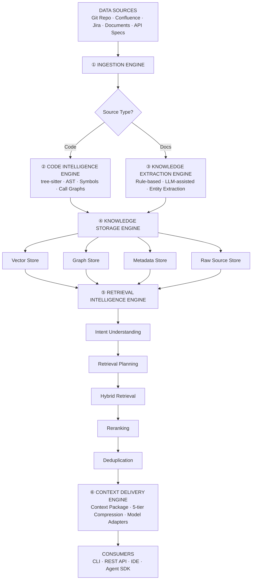

# PKH - Project Knowledge Harness

> Transform fragmented project information into a continuously evolving, connected, model-independent knowledge system.

## Architecture

## Design Principles

1. **Knowledge First** — Model is replaceable, knowledge is permanent
2. **Source Traceability** — Every knowledge traces back to its source via `SourceReference`
3. **Confidence Always** — Confidence scores (0.0–1.0) attached to all extracted knowledge
4. **Model Independence** — Swap any LLM via config only (adapter pattern)

## Core Concepts

| Concept | Description | Details |
|---------|-------------|---------|
| **KnowledgeObject** | Fundamental unit: ENTITY, RELATIONSHIP, DECISION, RULE with mandatory `source_references` and `confidence` | [`docs/core/3-knowledge-model.md`](docs/core/3-knowledge-model.md) |
| **Lifecycle** | 8 states with strict transitions: DISCOVERED → EXTRACTED → VALIDATING → ACTIVE ↔ UPDATED → SUPERSEDED → DEPRECATED → ARCHIVED | [`docs/core/4-knowledge-lifecycle.md`](docs/core/4-knowledge-lifecycle.md) |
| **Source of Truth** | Code→Git, Requirements→Jira, Decisions→Confluence, APIs→OpenAPI, Deployment→Infra config | [`docs/core/5-source-of-truth-model.md`](docs/core/5-source-of-truth-model.md) |
| **Retrieval** | Intent classification → Hybrid retrieval (RRF) → Reranking → Deduplication | [`docs/core/6-retrieval-strategy.md`](docs/core/6-retrieval-strategy.md) |
| **Context Delivery** | ContextPackage with 5-tier compression, model adapters | [`docs/core/7-context-contract.md`](docs/core/7-context-contract.md) |
| **Governance** | RBAC (5 roles), audit logging | [`docs/core/9-governance-and-trust-model.md`](docs/core/9-governance-and-trust-model.md) |

## Comparison with Alternatives

Comparison with Alternative Solutions

| Criterion | PKH | Traditional Wiki Tools (Confluence, Notion) | Code Search Tools (Sourcegraph, GitHub Code Search) | General RAG Systems |
|----------|-----|---------------------------------------------|----------------------------------------------------|---------------------|
| **Structured Architecture** | ✅ Structured objects + relationships | ❌ Free-form text, minimal structure | ❌ Code only, no semantic relationships | ⚠️ Depends on chunking, lacks ontology |
| **Source Traceability** | ✅ SourceReference mandatory | ❌ Often missing or manual | ✅ Direct links to source code | ⚠️ Often missing, depends on metadata |
| **Confidence Scoring** | ✅ 0.0-1.0 for all extracted knowledge | ❌ None | ❌ N/A (code is authoritative source) | ⚠️ Sometimes present, inconsistent |
| **Knowledge Lifecycle** | ✅ Full lifecycle (7 states, transition rules) | ❌ Static | ❌ N/A | ❌ Often missing |
| **Model Independence** | ✅ ContextPackage + Adapter | ❌ Tied to specific UI | ✅ Independent API | ⚠️ Prompt-dependent |
| **Knowledge Scope** | ✅ Comprehensive (code, projects, docs, systems) | ❌ Primarily documents | ❌ Code only | ⚠️ Depends on input data sources |
| **Quality Measurement** | ✅ Comprehensive framework | ❌ Limited (usage metrics only) | ⚠️ Some metrics (hit rate, latency) | ⚠️ Implementation-dependent |

---

## Conclusion

PKH is among the most complete and well-designed project knowledge systems available. It succeeds in:

- **Solving the right problem**: Fragmented project information is a real and significant challenge in software development
- **Applying sound design principles**: Knowledge First, Source Traceability, Confidence Scoring, and Model Independence
- **Providing concrete, measurable solutions**: Entities, relationships, lifecycle states, and a clear evaluation framework
- **Balancing idealism with practicality**: From concrete examples (ADR lifecycle, PaymentService) to real CLI commands and YAML configuration

---

## Design Principles

1. **Knowledge First** — Model is replaceable, knowledge is permanent
2. **Source Traceability** — Every knowledge answers "where did this come from?"
3. **Never Trust Extracted Knowledge Completely** — Confidence scores always attached
4. **Model Independence** — Any LLM can be swapped without changing knowledge core

## Entity & Relationship Types

**Entities (23)**: Code (11: REPOSITORY, MODULE, PACKAGE, FILE, CLASS, INTERFACE, FUNCTION, METHOD, ENUM, TYPE, VARIABLE), Project (4: EPIC, STORY, TASK, BUG), Document (4: REQUIREMENT, DECISION, DOCUMENT, BUSINESS_RULE), System (4: API, DATABASE, SERVICE, ENDPOINT)

**Relationships (15)**: IMPLEMENTS, DEPENDS_ON, CALLS, USES, OWNS, DOCUMENTS, REQUIRES, SUPERSEDES, RELATED_TO, AFFECTS, PART_OF, TRACES_TO, CONTAINS, EXTENDS, IMPLEMENTS_IFACE

## Documentation

| Document | Description |
|----------|-------------|
| `docs/plan/plan.md` | Master 30-day implementation plan |
| `docs/plan/daily/` | Day-by-day implementation targets (30 files) |
| `docs/core/1-vision-and-design-principles.md` | Vision & design principles |
| `docs/core/3-knowledge-model.md` | Entity/relationship types |
| `docs/core/4-knowledge-lifecycle.md` | State transitions & rules |
| `docs/core/5-source-of-truth-model.md` | Source hierarchy & traceability |
| `docs/core/6-retrieval-strategy.md` | Retrieval strategies per intent type |
| `docs/core/7-context-contract.md` | ContextPackage schema & compression |
| `docs/core/8-evaluation-framework.md` | Quality metrics & evaluation |
| `docs/core/9-governance-and-trust-model.md` | RBAC, audit, trust model |

## Tech Stack

| Component | Technology |
|-----------|------------|
| Language | Python 3.10+ |
| Models | Pydantic v2 |
| Code Parsing | tree-sitter |
| Vector Store | ChromaDB (dev) / pgvector (prod) |
| Graph Store | NetworkX (dev) / Neo4j (prod) |
| Metadata Store | SQLite + SQLAlchemy (dev) / PostgreSQL (prod) |
| LLM Adapters | Strategy pattern + config |
| CLI | Typer + Rich |
| API | FastAPI |
| Testing | pytest |

## License

MIT License - see LICENSE file for details.