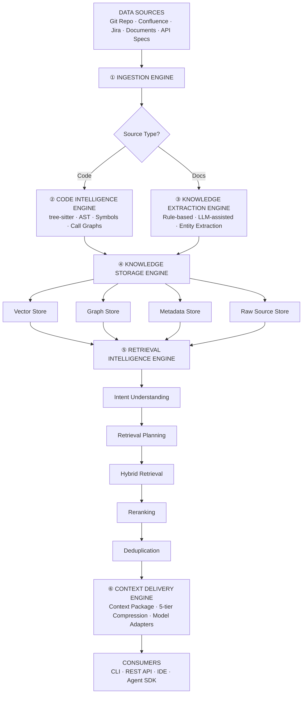

# PKH - Project Knowledge Harness

> Transform fragmented project information into a continuously evolving, connected, model-independent knowledge system.

## Architecture



## Design Principles

1. **Knowledge First** — Model is replaceable, knowledge is permanent
2. **Source Traceability** — Every knowledge traces back to its source via SourceReference
3. **Never Trust Extracted Knowledge Completely** — Confidence scores always attached (0.0–1.0)
4. **Model Independence** — Any LLM can be swapped without changing knowledge core

## Quick Start

```bash
# Install
pip install -e ".[dev]"

# Initialize config
pkh init

# Ingest a project (all sources)
pkh ingest --source git://https://github.com/org/project \
           --source confluence://PROJ-SPACE \
           --source jira://MYPROJECT

# Incremental sync (only changes)
pkh ingest --sync --incremental

# Query knowledge
pkh query "How does payment flow work?"

# Get context for AI agent
pkh context --query "Explain the authentication module"

# View knowledge graph
pkh graph --entity "PaymentService"

# Check status
pkh status
```

## Configuration

Edit `config/settings.yaml`:

```yaml
# ── Sources ──────────────────────────────────────────────────────────
sources:
  git:
    repos:
      - url: https://github.com/org/project
        branch: main
        sync_interval: 5m
        auth:
          type: token
          token_ref: secrets.GIT_TOKEN
        include_paths: ["**/*.py", "**/*.ts", "**/openapi.yaml"]
        exclude_paths: ["**/test_*.py", "**/__pycache__/**"]
  
  confluence:
    base_url: https://your-company.atlassian.net
    spaces: [PROJ, DOCS]
    sync_interval: 1h
    auth:
      type: oauth2
  
  jira:
    base_url: https://your-company.atlassian.net
    projects: [PROJ]
    sync_interval: 15m
    auth:
      type: oauth2
    issue_types: [Bug, Story, Task, Epic]
  
  documents:
    paths:
      - local: ./docs
      - url: https://example.com/specs
    sync_interval: 1h
    supported_formats: [md, pdf, yaml, json]

# ── Storage ──────────────────────────────────────────────────────────
storage:
  vector:
    provider: chroma        # chroma | pgvector
    path: ./data/vectorstore
  graph:
    provider: networkx      # networkx | neo4j
    path: ./data/graph
  metadata:
    provider: sqlite        # sqlite | postgresql
    path: ./data/metadata.db
  raw:
    provider: filesystem    # filesystem | s3
    path: ./data/raw

# ── Retrieval ────────────────────────────────────────────────────────
retrieval:
  top_k: 10
  min_confidence: 0.3
  hybrid: true
  rerank: true
  fusion:
    method: rrf             # rrf | weighted
    k: 60
  strategies:
    vector:
      enabled: true
      top_k: 20
      threshold: 0.75
    keyword:
      enabled: true
      boost_title: 2.0
    graph:
      enabled: true
      max_hops: 3
      relations: [DEPENDS_ON, CALLS, USES, AFFECTS, IMPLEMENTS]
  reranking:
    confidence_weight: 0.3
    lifecycle_weight: 0.2
    recency_weight: 0.1
    relevance_weight: 0.4

# ── LLM Adapters ─────────────────────────────────────────────────────
adapters:
  default: claude
  models:
    claude:
      model: claude-sonnet-4-20250514
      api_key: ${ANTHROPIC_API_KEY}
    openai:
      model: gpt-4o
      api_key: ${OPENAI_API_KEY}

# ── Governance ───────────────────────────────────────────────────────
governance:
  rbac:
    default_role: developer
  audit:
    enabled: true
    retention_years: 1
```

---

## Core Concepts

### KnowledgeObject — The Fundamental Unit

Every piece of knowledge in the system is a `KnowledgeObject`:

```python
class KnowledgeObject(BaseModel):
    id: str                              # UUID v4
    object_type: ObjectType              # ENTITY | RELATIONSHIP | DECISION | RULE
    title: str
    description: str = ""
    content: str = ""                    # For vector indexing
    source_references: list[SourceReference]  # ALWAYS non-empty
    confidence: float = 1.0              # 0.0 - 1.0
    lifecycle_state: LifecycleState      # See lifecycle below
    created_at: datetime
    updated_at: datetime
    tags: list[str] = []
    properties: dict[str, Any] = {}
```

### Knowledge Lifecycle

> Full lifecycle details: `docs/core/4-knowledge-lifecycle.md`

```
DISCOVERED → EXTRACTED → VALIDATING → ACTIVE ←→ UPDATED
                                      ↓
                                SUPERSEDED → DEPRECATED → ARCHIVED
```

| State | Description | Queryable? |
|-------|-------------|------------|
| DISCOVERED | Raw data found, not processed | No |
| EXTRACTED | Knowledge extracted, pending validation | Yes (flagged) |
| VALIDATING | Under validation checks | No |
| ACTIVE | Validated and live | Yes |
| UPDATED | Source changed, re-validation pending | Yes (flagged) |
| SUPERSEDED | Replaced by newer knowledge | No |
| DEPRECATED | No longer in use | No |
| ARCHIVED | Preserved for history (read-only) | No (read-only) |

| DEPRECATED | No longer in use | No |
| ARCHIVED | Preserved for history (read-only) | No (read-only) |

**Staleness rules:** >7 days unsynced → warning; >30 days → prompt re-sync; >90 days → suggest deprecation.

### Source of Truth

| Knowledge | Source of Truth |
|-----------|----------------|
| Code implementation | Git Repository (commit hash) |
| Requirement | Jira (issue key) |
| Architecture decision | Confluence / ADR (page ID) |
| API Contract | OpenAPI spec (file path + endpoint) |
| Deployment | Infrastructure config (versioned) |

Every `KnowledgeObject` carries one or more `SourceReference`s that link back to the original source. This ensures full traceability: **"Where did this come from?"** always has an answer.

### SourceReference

```python
class SourceReference(BaseModel):
    source_type: SourceType              # GIT | CONFLUENCE | JIRA | DOCUMENT | API_SPEC
    source_id: str                       # commit hash, page ID, issue key, etc.
    url: str = ""                        # Direct link to source
    title: str = ""
    last_synced: datetime
    extra: dict[str, Any] = {}           # Type-specific metadata
```

### Entity Types (23 total)

| Category | Types |
|----------|-------|
| **Code** (11) | REPOSITORY, MODULE, PACKAGE, FILE, CLASS, INTERFACE, FUNCTION, METHOD, ENUM, TYPE, VARIABLE |
| **Project** (4) | EPIC, STORY, TASK, BUG |
| **Document** (4) | REQUIREMENT, DECISION, DOCUMENT, BUSINESS_RULE |
| **System** (4) | API, DATABASE, SERVICE, ENDPOINT |

### Relationship Types (15 total)

`IMPLEMENTS` · `DEPENDS_ON` · `CALLS` · `USES` · `OWNS` · `DOCUMENTS` · `REQUIRES` · `SUPERSEDES` · `RELATED_TO` · `AFFECTS` · `PART_OF` · `TRACES_TO` · `CONTAINS` · `EXTENDS` · `IMPLEMENTS_IFACE`

---

## CLI Reference

| Command | Description |
|---------|-------------|
| `pkh init` | Scaffold project config |
| `pkh ingest --source <type>://<path>` | Ingest from a source |
| `pkh ingest --sync [--incremental]` | Run sync pipeline |
| `pkh query "<question>"` | Natural language query |
| `pkh context --query "..."` | Get raw context package for AI agents |
| `pkh graph --entity "Name"` | Visualize knowledge graph |
| `pkh status` | Show ingestion status, counts, freshness |
| `pkh audit` | View audit log (ADMIN/ARCHITECT) |

## API Reference

| Endpoint | Method | Description |
|----------|--------|-------------|
| `/ingest` | POST | Trigger ingestion |
| `/ingest/status` | GET | Check ingestion status |
| `/query` | POST | Natural language query |
| `/context` | POST | Get context package |
| `/knowledge/{id}` | GET | Get knowledge object |
| `/graph/explore` | GET | Explore knowledge graph |
| `/sources/status` | GET | Check source sync status |
| `/health` | GET | Health check |

## Access Control (RBAC)

| Role | Can Read | Can Ingest | Can Configure | Can Audit |
|------|----------|------------|---------------|-----------|
| ADMIN | All | All | All | All |
| ARCHITECT | All | All | No | Yes |
| DEVELOPER | Own projects | Own repos | No | No |
| VIEWER | Public only | No | No | No |
| SERVICE | Scoped | Scoped | No | No |

---

## Tech Stack

| Component | Technology | Why |
|-----------|------------|-----|
| Language | Python 3.10+ | Rich ecosystem for NLP, AST, LLM |
| Models | Pydantic v2 | Strong typing, validation, serialization |
| Code Parsing | tree-sitter | Language-agnostic, incremental, fast |
| Vector Store | ChromaDB (dev) / pgvector (prod) | Lightweight, embedded |
| Graph Store | NetworkX (dev) / Neo4j (prod) | Pure Python, serializable |
| Metadata Store | SQLite + SQLAlchemy (dev) / PostgreSQL (prod) | Zero config, ACID |
| LLM Adapters | Strategy pattern + config | True model independence |
| CLI | Typer + Rich | Type-safe, beautiful output |
| API | FastAPI | Async, auto-docs, fast |
| Testing | pytest | Industry standard |

---

## Comparison with Alternatives

Comparison with Alternative Solutions

| Criterion | PKH | Traditional Wiki Tools (Confluence, Notion) | Code Search Tools (Sourcegraph, GitHub Code Search) | General RAG Systems |
|----------|-----|---------------------------------------------|----------------------------------------------------|---------------------|
| **Structured Architecture** | ✅ Structured objects + relationships | ❌ Free-form text, minimal structure | ❌ Code only, no semantic relationships | ⚠️ Depends on chunking, lacks ontology |
| **Source Traceability** | ✅ SourceReference mandatory | ❌ Often missing or manual | ✅ Direct links to source code | ⚠️ Often missing, depends on metadata |
| **Confidence Scoring** | ✅ 0.0-1.0 for all extracted knowledge | ❌ None | ❌ N/A (code is authoritative source) | ⚠️ Sometimes present, inconsistent |
| **Knowledge Lifecycle** | ✅ Full lifecycle (7 states, transition rules) | ❌ Static | ❌ N/A | ❌ Often missing |
| **Model Independence** | ✅ ContextPackage + Adapter | ❌ Tied to specific UI | ✅ Independent API | ⚠️ Prompt-dependent |
| **Knowledge Scope** | ✅ Comprehensive (code, projects, docs, systems) | ❌ Primarily documents | ❌ Code only | ⚠️ Depends on input data sources |
| **Quality Measurement** | ✅ Comprehensive framework | ❌ Limited (usage metrics only) | ⚠️ Some metrics (hit rate, latency) | ⚠️ Implementation-dependent |

---

## Conclusion

PKH is among the most complete and well-designed project knowledge systems available. It succeeds in:

- **Solving the right problem**: Fragmented project information is a real and significant challenge in software development
- **Applying sound design principles**: Knowledge First, Source Traceability, Confidence Scoring, and Model Independence
- **Providing concrete, measurable solutions**: Entities, relationships, lifecycle states, and a clear evaluation framework
- **Balancing idealism with practicality**: From concrete examples (ADR lifecycle, PaymentService) to real CLI commands and YAML configuration

---

## Design Principles

1. **Knowledge First** — Model is replaceable, knowledge is permanent
2. **Source Traceability** — Every knowledge answers "where did this come from?"
3. **Never Trust Extracted Knowledge Completely** — Confidence scores always attached
4. **Model Independence** — Any LLM can be swapped without changing knowledge core

