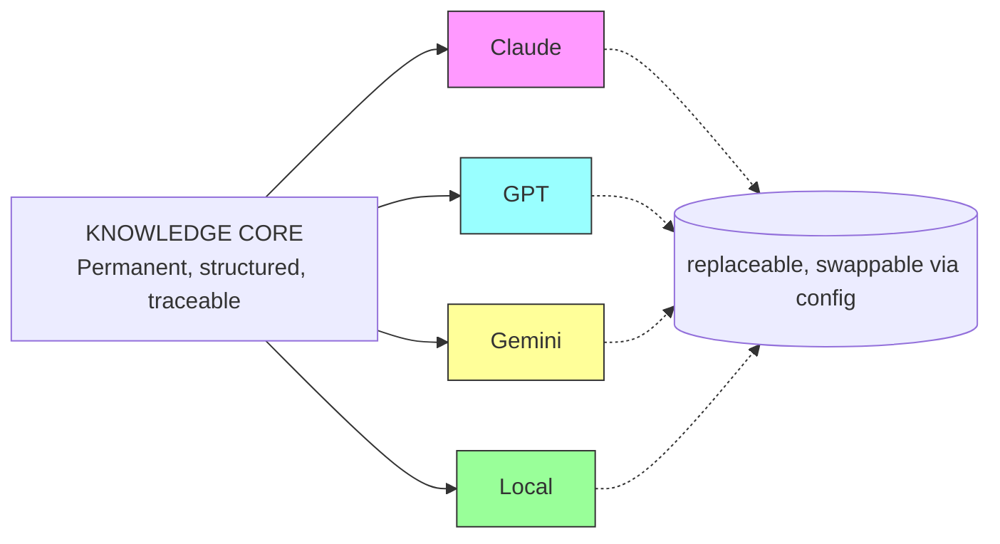
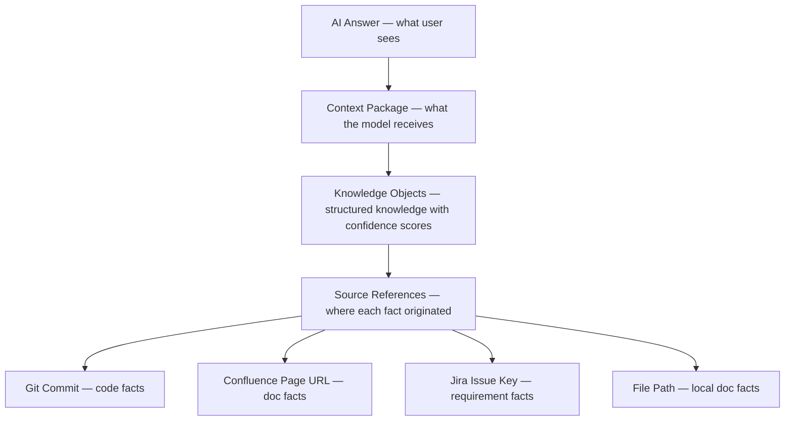
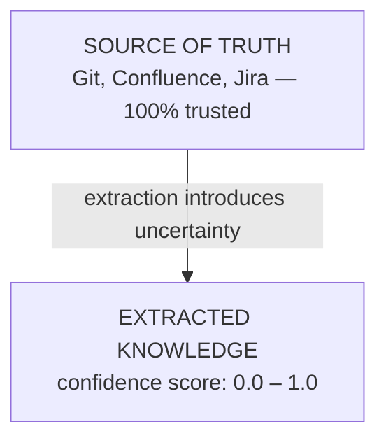
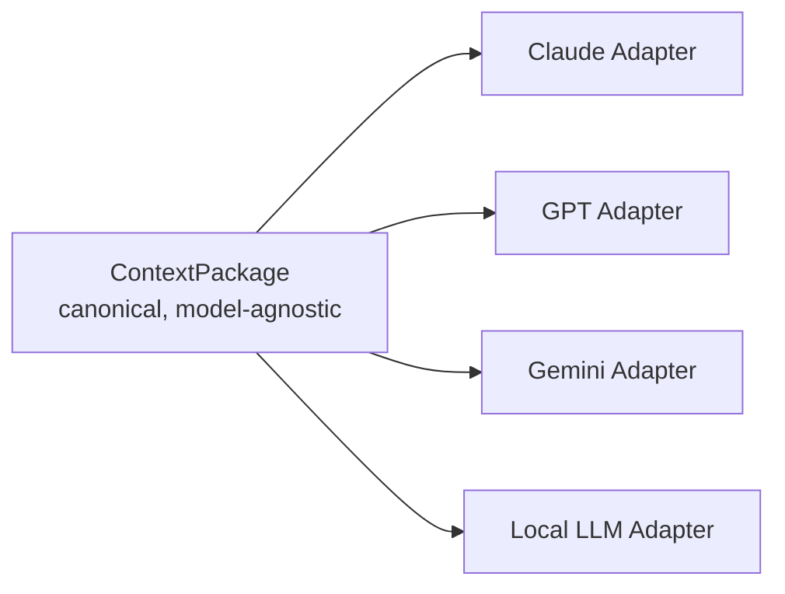

# Vision & Design Principles

> Transform fragmented project information into a continuously evolving, connected, and model-independent knowledge system.

[[glossary]]

---

## Core Principles

### Principle 1 — Knowledge First

**Model is replaceable. Knowledge is permanent.**

The knowledge core persists regardless of which LLM backend is used. Models are consumers, not owners.

**Design implication:** No knowledge is stored in model-specific formats. All knowledge is in the Knowledge Model (entities, relationships, lifecycle states). Model adapters only affect the output presentation layer.

---

### Principle 2 — Source Traceability

**Every piece of knowledge must answer: Where did this come from?**

There is no such thing as "orphaned knowledge." Every KnowledgeObject carries a traceability chain back to its source of truth.

**Design implication:** Every KnowledgeObject MUST have at least one SourceReference. Retrieval always returns sources. ContextPackage always includes source URLs/links.

---

### Principle 3 — Never Trust Extracted Knowledge Completely

**Knowledge extracted by AI is an intermediate representation, NOT the source of truth.**

The extraction process (rule-based + LLM-assisted) introduces uncertainty. Every piece of extracted knowledge carries a confidence score reflecting that uncertainty.

**Confidence tiers:**

| Confidence | Range | Treatment |
|------------|-------|-----------|
| **High** | > 0.8 | Rule-based extraction, clear patterns — trust for most queries |
| **Medium** | 0.5 – 0.8 | LLM-assisted extraction — include but flag in context |
| **Low** | < 0.5 | Ambiguous extraction — include in retrieval but mark for human review |

**Design implication:** Retrieval engines filter by confidence threshold per query type. Low-confidence knowledge is never silently returned as fact.

---

### Principle 4 — Model Independence

**No knowledge should depend on a specific LLM vendor.**

The system delivers knowledge in a model-agnostic format (ContextPackage). The adapter layer handles conversion to whatever LLM the consumer needs.

**Design implication:**
- All LLM calls go through the adapter interface (`ModelAdapter` protocol)
- Switching models = changing config only, zero code changes
- No hardcoded model-specific logic in engines

---

## Non-Goals

PKH is deliberately scoped. These are NOT part of this project:

| Out of Scope | Why |
|-------------|-----|
| Chatbot for project Q&A | PKH provides knowledge TO chatbots, it isn't one itself |
| Documentation generator | PKH consumes docs, doesn't create them |
| Code linter / formatter | That's already solved by existing tools |
| CI/CD pipeline management | PKH integrates with CI/CD, doesn't replace it |
| Project management tool | PKH reads from Jira, doesn't manage tickets |
| Replacement for Git / Confluence / Jira | PKH sits alongside these tools |

PKH is a **knowledge infrastructure layer** — it enriches existing tools with structured, queryable knowledge.

---

## Design Decisions Rationale

| Decision | Rationale |
|----------|-----------|
| Python 3.10+ | Rich NLP/AST/LLM ecosystem; Pydantic v2 for validation |
| tree-sitter for parsing | Language-agnostic, incremental, fast AST generation |
| Pydantic models for KnowledgeObject | Strong typing, validation, serialization, OpenAPI-friendly |
| Polyglot persistence | Each storage layer uses best-fit technology |
| Adapter pattern for LLMs | True model independence; future-proof against vendor changes |
| Confidence scoring | Honesty about extraction uncertainty; enables human-in-the-loop |
| Lifecycle states | Prevents stale knowledge from poisoning queries |

