# Architecture -- Engines as Execution Capabilities

> [[glossary]]
> **Scope của file này:** Chi tiết 6 Engines như *execution capabilities* (input/output/capabilities). Để xem toàn cảnh 4 Domains + Consumers + Governance, đọc `docs/overall-architecture.md` (system overview). Hai file bổ sung nhau, không trùng — file này deep-dive, file kia big-picture.

## System Structure

```mermaid
graph TD
    SRC[DATA SOURCES\nGit | Confluence | Jira | Documents] --> DOM[4 DOMAINS\nAcquisition | Core | Intelligence | Consumption]
    DOM --> ENG[6 EXECUTION CAPABILITIES\nEngines 1-6]

    subgraph Domain1 [Domain 1: Knowledge Acquisition]
        E1[① INGESTION ENGINE\nConnect, sync, normalize raw data\nConnectors: Git, Confluence, Jira, Document]
        E2[② CODE INTELLIGENCE ENGINE\nAST Parsing, Symbols, Dependencies, Call graphs]
        E3[③ KNOWLEDGE EXTRACTION ENGINE\nEntity/Relationship extraction\nRule-based + LLM-assisted\nConfidence scoring]
    end

    subgraph Domain2 [Domain 2: Knowledge Core]
        KC[KNOWLEDGE CORE\nCanonical Memory of Project]
        E4[④ KNOWLEDGE STORAGE ENGINE\nVector Store | Graph Store\nMetadata Store | Raw Sources]
    end

    subgraph Domain3 [Domain 3: Knowledge Intelligence]
        E5[⑤ RETRIEVAL INTELLIGENCE ENGINE\nIntent Detection → Query Planning\nHybrid Retrieval → Reranking → Dedup]
        E6[⑥ CONTEXT DELIVERY ENGINE\nContextAssembly | Compression\nContract Validation | Model Adapters\nOutput: ContextPackage]
    end

    SRC --> E1
    E1 --> E2
    E1 --> E3
    E2 --> E3
    E3 --> KC
    KC --> E4
    E4 --> E5
    E5 --> E6

    subgraph Domain4 [Domain 4: Knowledge Consumption]
        CONSUMERS[CONSUMERS\nHuman: Developer, Architect\nAI Agent: Claude, Cline, Cursor\nApp: IDE, Dashboard, CI/CD\nModel: Claude, GPT, Gemini, Local]
    end

    E6 --> CONSUMERS
```

---

## Engine Mapping to Domains

```mermaid
graph TD
    E1[① INGESTION ENGINE\nConnect, sync, normalize\nInput: Git, Confluence, Jira, Documents, API Specs\nCapabilities: Connectors, Sync & Webhooks, Change Detection, Normalization\nOutput: Normalized RawItems lifecycle=DISCOVERED]
    E1 --> E2
    E2[② CODE INTELLIGENCE ENGINE\nUnderstand code structurally\nInput: Source Code\nCapabilities: AST Parsing tree-sitter, Symbol Table, Dependency Analysis, Call Graph Building\nOutput: Code entities + DEPENDS_ON, CALLS relationships]
    E2 --> E3
    E3[③ KNOWLEDGE EXTRACTION ENGINE\nConvert information → explicit knowledge\nInput: Raw data from 1 & 2\nCapabilities: Entity Extraction rule+LLM, Relationship Extraction, Decision Detection, Confidence Scoring\nOutput: Entities, Relationships, Decisions, Rules]
    E3 --> KC
    KC[KNOWLEDGE CORE\nCanonical Memory of Project\nEntity Model | Relationship Model | Lifecycle Model | Source of Truth]
    KC --> E4
    E4[④ KNOWLEDGE STORAGE ENGINE\nPersist knowledge across layers\nStorage Layers: Vector Store semantic search, Graph Store relational traversal\nMetadata Store SQL traceability, Raw Sources original data]
    E4 --> E5
    E5[⑤ RETRIEVAL INTELLIGENCE ENGINE\nFind relevant knowledge intelligently\nCapabilities: Intent Detection, Query Planning, Hybrid Retrieval\nGraph Traversal, Reranking, Deduplication]
    E5 --> E6
    E6[⑥ CONTEXT DELIVERY ENGINE\nAssemble model-ready context packages\nCapabilities: Context Assembly, Compression, Contract Validation, Model Adapters\nOutput: ContextPackage → Any LLM]
    E6 --> CON[CONSUMERS\nHuman: Developer, Architect\nAI Agent: Claude Code, Cline, Cursor\nApp: IDE, Dashboard, CI/CD\nModel: Claude, GPT, Gemini, Local]
```

---

## Data Flow

```mermaid
graph LR
    SRC[Git/Confluence/Jira/Documents] --> E1[① Ingestion Engine]
    E1 -->|Normalized RawItems| E2[② Code Intelligence Engine]
    E1 -->|Non-code docs| E3[③ Knowledge Extraction Engine]
    E2 -->|CodeEntities| E3
    E3 -->|KnowledgeObjects EXTRACTED| E4[④ Knowledge Storage Engine]
    E4 -->|Vector + Graph + Metadata| E5[⑤ Retrieval Intelligence Engine]
    E5 -->|RelevantKnowledgeSet| E6[⑥ Context Delivery Engine]
    E6 -->|ContextPackage| CON[Any LLM / Consumer]
```



---

## Cross-Cutting Capabilities

These capabilities run across ALL engines:

+----------------+  +----------------+  +----------------+  +----------------+
|  Lifecycle     |  |  Traceability  |  |  Governance    |  |  Evaluation    |
|                |  |                |  |  & Trust       |  |  & Observability|
| DISCOVER ->    |  | Every knowledge|  | + Auth         |  | + Knowledge    |
| EXTRACT ->     |  | traces back to |  | + Authz        |  |   Quality      |
| VALIDATE ->    |  | source         |  | + Access Ctrl  |  | + Retrieval    |
| ACTIVATE ->    |  |                |  | + Audit Log    |  |   Precision    |
| UPDATE ->      |  | Example:       |  |                |  | + Context      |
| SUPERSEDE ->   |  | Answer ->      |  | Principle:     |  |   Relevance    |
| DEPRECATE ->   |  | Context ->     |  | Harness cannot |  | + System       |
| ARCHIVE        |  | Knowledge ->   |  | give access to |  |   Metrics      |
|                |  | Source         |  | knowledge user |  |                |
+----------------+  | References     |  | cannot access  |  +----------------+
                    +----------------+  | in source      |
                                        +----------------+
