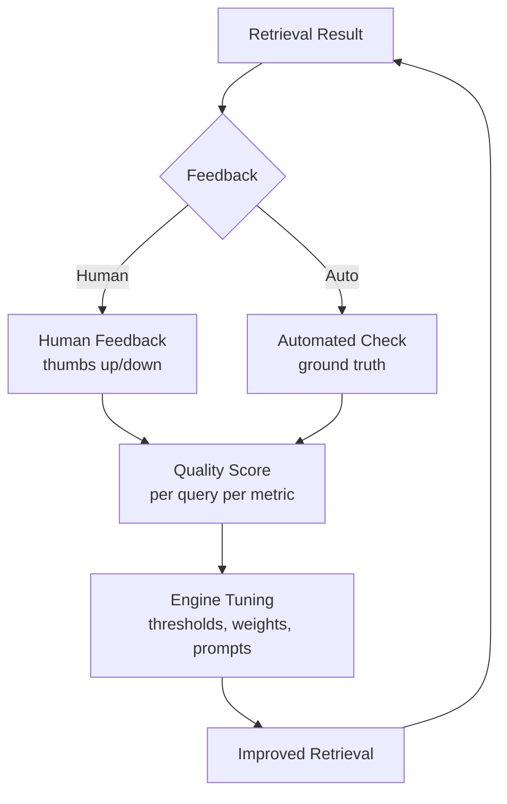

# Quality & Trust Layer

> Cross-cutting: How do we know the Harness is doing its job well?

---

## Quality Dimensions

Quality is measured across four dimensions. Each dimension has specific metrics and targets.

### Dimension 1: Knowledge Quality

Measures the quality of knowledge stored in the Knowledge Core.

| Metric | Formula | Target | Measurement |
|--------|---------|--------|-------------|
| Coverage | `indexed_entities / total_expected` | > 80% | Count entities from sources vs. expected |
| Freshness | `avg(age_of_last_sync)` per source | < 24h | Query Metadata Store for last_synced |
| Confidence Avg | `avg(confidence)` over ACTIVE knowledge | > 0.7 | Aggregate from KnowledgeObjects |
| Completeness | `% with >= 1 SourceReference` | > 95% | Count objects with empty source_references |
| Lifecycle Compliance | `% with valid state` | > 99% | Check for orphaned or invalid states |
| Duplicate Rate | `% that are duplicates` | < 5% | Compare content hashes within same source |

### Dimension 2: Retrieval Quality

Measures how well the Retrieval Intelligence Engine finds the right knowledge.

| Metric | Formula | Target | Measurement |
|--------|---------|--------|-------------|
| Precision@K | `relevant_in_top_K / K` | > 0.8 | Golden test set evaluation |
| Recall@K | `relevant_found / total_relevant` | > 0.7 | Golden test set evaluation |
| NDCG@K | Normalized Discounted Cumulative Gain | > 0.75 | Rank-aware relevance scoring |
| MRR | Mean Reciprocal Rank | > 0.8 | Position of first relevant result |
| Latency p50 | 50th percentile query latency | < 300ms | Timing middleware |
| Latency p99 | 99th percentile query latency | < 2000ms | Timing middleware |
| Cache Hit Rate | `cached / total queries` | > 60% | Track cache lookups |

### Dimension 3: Context Quality

Measures how well the Context Delivery Engine assembles usable context.

| Metric | Formula | Target | Measurement |
|--------|---------|--------|-------------|
| Token Efficiency | `useful_tokens / total_tokens` | > 0.6 | Estimate useful = content minus metadata |
| Source Coverage | `% of chunks with valid sources` | > 0.9 | Validate each chunk has sources |
| Hallucination Rate | `unsupported_claims / total_claims` | < 0.05 | Sample LLM responses, check against source |
| Context Utilization | `% of context tokens used in response` | > 0.4 | Compare input vs. output relevance |

### Dimension 4: System Quality

Measures operational health of the entire Harness.

| Metric | Formula | Alert Threshold | Measurement |
|--------|---------|-----------------|-------------|
| Ingestion Rate | `documents / minute` | < 10 doc/min (suspicious) | Engine counters |
| Sync Success Rate | `successful / total syncs` | < 95% | Connector health checks |
| Error Rate | `failed ops / total ops` | > 1% | Structured error logging |
| Cost per Query | `(embedding + LLM tokens) / queries` | Track trend | API cost tracking |
| Uptime | `available / total time` | > 99.5% | Health check endpoint |

---

## Trust Mechanisms

| Mechanism | How It Works | Where Enforced |
|-----------|--------------|----------------|
| **Source of Truth** | Every knowledge links to original source | Engine 1 (ingestion), Engine 3 (extraction) |
| **Confidence Scoring** | Every extraction gets 0.0-1.0 score | Engine 3 (extraction), Engine 5 (reranking) |
| **Lifecycle State** | Stale knowledge is flagged/superseded | Update Loop domain, Engine 5 (filtering) |
| **Audit Log** | Every access and operation is logged | Governance layer, all write/read operations |
| **Access Control** | Harness cannot give access beyond user privileges | Engine 5 (retrieval filter), Engine 4 (storage) |
| **Validation Gates** | Knowledge must pass checks before being stored | Engine 4 (write validation) |

---

## Evaluation Feedback Loop

**Feedback sources:**
1. **Daily automated tests** -- synthetic queries against known knowledge
2. **Weekly human review** -- sample of real queries evaluated by domain expert
3. **Monthly trend reports** -- metric trends over time

---

## Observability

| Signal | Tool | Purpose |
|--------|------|---------|
| Engine metrics | Prometheus / in-memory | Track ingestion rate, error rate, latency |
| Knowledge quality | Custom dashboard | Coverage, freshness, confidence trends |
| Retrieval quality | Test suite | Precision/recall over time |
| Audit log | Append-only table | Who accessed what, when |
| Health checks | `/health` endpoint | System availability |