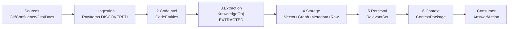

# System Design Layer

> Answers: How does the system work?

---

## Architecture Overview

```mermaid
graph TD
    SRC[DATA SOURCES\nGit | Confluence | Jira | Documents | API Specs]
    SRC --> DOM[4 DOMAINS\nAcquisition | Core | Intelligence | Consumption]
    DOM --> KM[KNOWLEDGE MODEL\nEntity Types | Relationship Types | Lifecycle States | SourceReference]
    KM --> CC[CROSS-CUTTING CAPABILITIES\nLifecycle | Traceability | Governance & Trust | Evaluation]
    CC --> CON[CONSUMERS\nCLI | REST API | IDE | Web Dashboard | Agent SDK | LLM]
```

---

## Layer Responsibilities

| Layer | Questions It Answers | Key Artifacts |
|-------|---------------------|---------------|
| **Philosophy** | Why are we building this? | Vision, principles, non-goals |
| **Knowledge Design** | What is knowledge? | Entity taxonomy, relationship taxonomy, lifecycle states, SourceReference model |
| **System Design** | How does the system work? | Domain/Engine mapping, data flow, cross-cutting capabilities |
| **Quality & Trust** | How do we know it''s working? | Metrics, evaluation framework, trust mechanisms |

---

## Domain-to-Engine Mapping

| Domain | Responsibility | Engines | Output |
|--------|---------------|---------|--------|
| **Knowledge Acquisition** | Collect & understand raw data | 1. Ingestion, 2. Code Intelligence, 3. Knowledge Extraction | KnowledgeObjects (EXTRACTED) |
| **Knowledge Core** | Store & maintain canonical memory | 4. Knowledge Storage | Knowledge persisted in 4 layers |
| **Knowledge Intelligence** | Retrieve & reason over knowledge | 5. Retrieval Intelligence, 6. Context Delivery | ContextPackage |
| **Knowledge Consumption** | Deliver to consumers | (Consumer interfaces) | Answers, visualizations, tool calls |

---

## Data Flow (Full Pipeline)



---

## Cross-Cutting Concerns

These capabilities span ALL domains and engines:

| Capability | Where It Acts | What It Does |
|------------|--------------|--------------|
| **Lifecycle** | All engines | Manages knowledge state transitions (DISCOVERED -> ACTIVE -> ...) |
| **Traceability** | All engines | Ensures every KnowledgeObject links to its source |
| **Governance** | Storage + Retrieval | Enforces access control, data classification, audit logging |
| **Evaluation** | All engines | Measures quality metrics, feeds back to tuning |

---

## Technology Stack

| Concern | Choice | Rationale |
|---------|--------|-----------|
| Language | Python 3.10+ | Rich NLP/AST/LLM ecosystem |
| Data models | Pydantic v2 | Strong typing, validation, serialization |
| Code parsing | tree-sitter | Language-agnostic, incremental, fast |
| Vector store | ChromaDB (dev) / pgvector (prod) | Lightweight, embeddable |
| Graph store | NetworkX (dev) / Neo4j (prod) | Pure Python, serializable |
| Metadata store | SQLite (dev) / PostgreSQL (prod) | ACID, portable, powerful queries |
| LLM adapters | Strategy pattern + config | True model independence |
| CLI | Typer + Rich | Type-safe, beautiful output |
| API | FastAPI | Async, auto-docs, fast |
| Testing | pytest | Standard Python test framework |